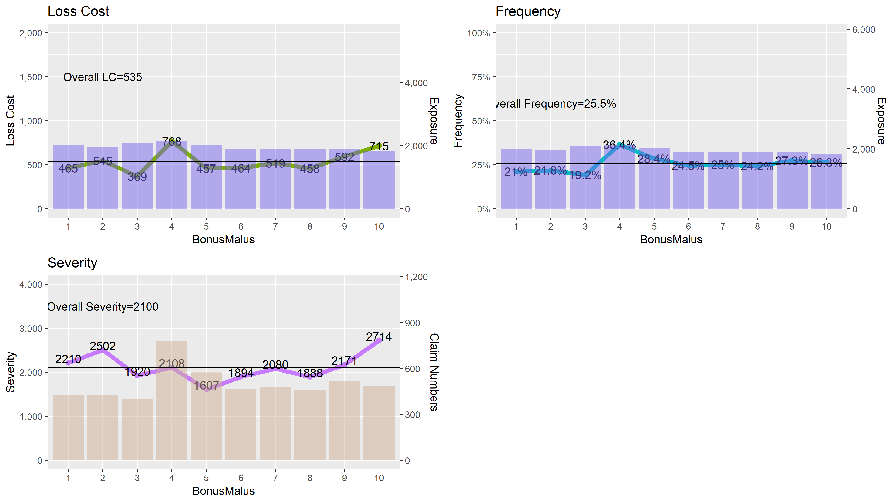
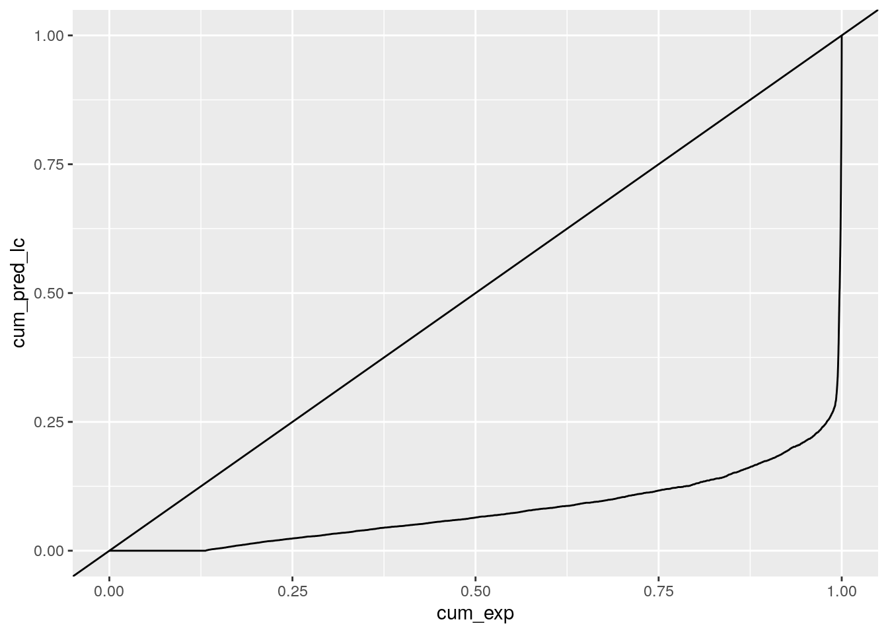
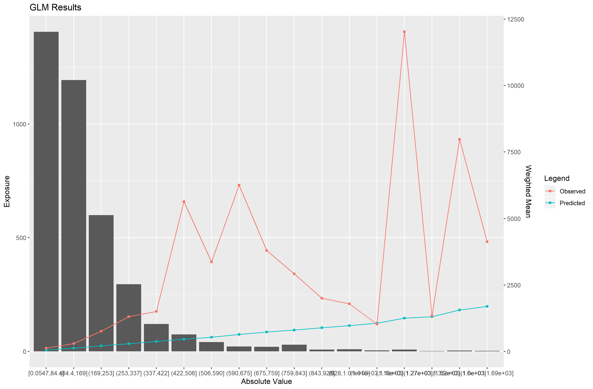
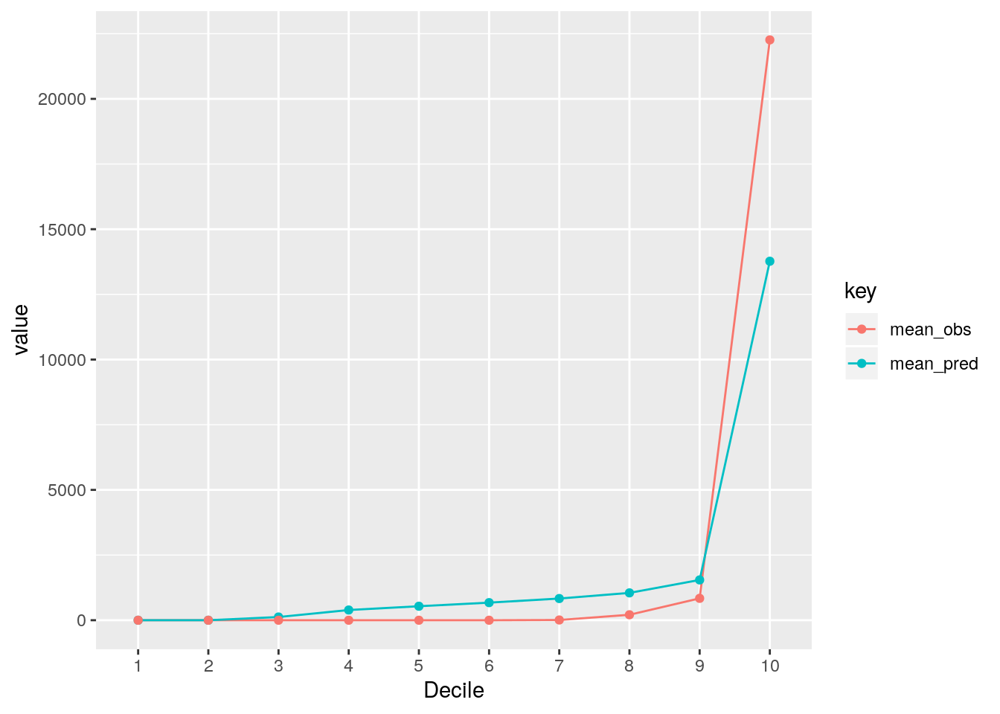

# Pricing Project

## Objective

The aim of the project is to make a comparison between a traditional standard ratemaking approach, i.e. GLM and a more sophisticated one using Machine Learning techniques.

## Project Guidelines

In order to keep everything consistent and easy to understand by everyone we agreed on using a standard approach for the selection and performance evaluation of the model.  
Moreover, it will be necessary to bring all the individual codes and models together and, keeping everything tidy will simplify this phase.

# Sections

1. Import and data processing
2. Initial exploratory analysis (e.g. One-Way Tables)
3. Fitting and refinement of the model
4. Evaluating Performances

## Import and data processing

The dataset is a French MPL dataset. In the data folder there are three main files:

1. The full dataset
2. A train dataset
3. A test dataset

## Initial exploratory analysis

This phase consists in looking at the relation between the variables and the main actuarial metrics such as Frequency, Severity and Loss Cost.  
We do not have premium data and so we cannot calculate LR.  
An example on how these table can be built is the following graph:

## Fitting and refinement of the model

We agreed on fitting the following models, however we can always expand this list and ad more, so, please, do not hesitate to suggest your ideas

1. GLM
2. GAM
3. GBM
4. NN

Each one of us can follow their preferred approach to fit and refine the model. Try, however, to keep the code clear and insert comments for others to understand.

## Evaluating Performances

This is one of the most important section because it will allow us to compare all the models and show the main advantages of ML models over standard approaches.

We agreed on the following metrics/graphs to be shown:

1. Gini Index
2. NRMSE
3. Double Lift Curves (standard and modified versions)

### Gini Index

A gini index show the discriminatory power of a model. 
It is the area between the Lorenz Curve and the bisector.

An example plot:

### NRMSE

Normalized Root Mean Squared Error. It shows the error of the model, i.e. how far the predictions are compared to the observed values.

### Lift Curves

They compared the mean value of the percentiles for actual and expected figures. The closer they are, the better the model is.  
Modified Versions includes adding exposure volumes and/or taking fixed intervals on the y axis.

#### Standard

#### Modified

## Final Comments

As previously said this is just the approach we discussed during the call. Everyone is welcome to contribute and add or modify paragraphs.  
Please try to keep your code tidy and add comments for others to understand.
Over the next few days I will add a file `utils.R` in which I will put the functions to create the graph and the performance metrics. This is to have something standard across everyone.

Of course, any suggestions will be appreciated. Thank you.

